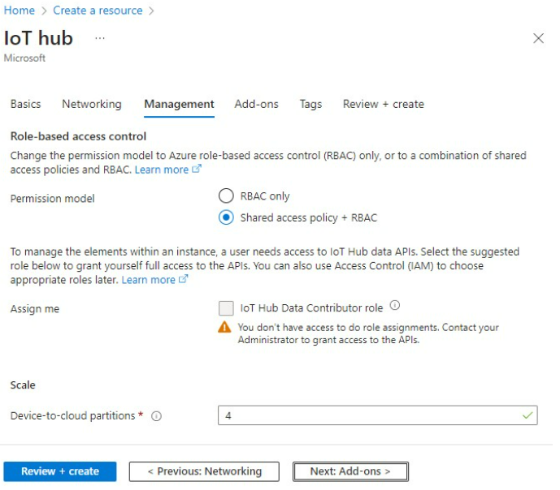

# Azure Cloud Demo

This application allows the RNWF11 board to act as MQTT client and connect to (and communicate) Azure IoT application. The module comes with the required X.509 certificates that simplify TLS handshake protocol with Microsoft Azure. It only needs secure device certificate on Azure for individual enrollment. Then, using AT+commands, user can connect the RNWF11 to Azure IoT Hub.

## Building the Application

To build this application, open the project file (`apps/azure_demo/firmware/azure_demo_sam_e54_xpro_rnwf02.X`\) in MPLAB X IDE. For more details on opening the project file in MPLAB X IDE, refer to the [Opening the Project file](../wifi_easy_config/docs/GUID-671CCA8C-64AE-4EA1-B144-D46A6FEE76FF.md). The following table provides details on the project file.

|Project Name|Description|
|:-----------|:----------|
|`azure_demo_sam_e54_xpro_rnwf02.X`|  MPLAB X project for SAM E54 Xplained Pro evaluation kit and RNWF02 Add On Board
-   This application demonstrates the Azure Plug and Play connection with the Azure IoT Central. Using this application, most users can connect their Microchip RNWF02 to Azure Cloud/Azure IoT Hub in a few minutes.

## Running the Application

1.  **Create a Root of Trust Chain for RNWF Devices:**

    The demo application includes a set of tools in `../apps/azure_demo/tools` folder. It enables easy creation of certificate infrastructure and individual device certificates with very minimal user inputs.

    **Note:**

    -   On Windows Operating Systems, make sure the [GitBash](https://git-scm.com/download/win) is installed to run these tools.
    -   These scripts are based on the Azure's [Create and Upload Certificates for Testing](https://learn.microsoft.com/en-us/azure/iot-hub/tutorial-x509-test-certs?tabs=windows) tutorial.
     

    1.  Right click and open the Git Bash in the tools folder

        

    2.  Run the *create\_initial\_setup.sh* as illustrated in the following figure. It will request the user to provide the domain suffix and common name for Root CA.

        

    3.  Up on successful execution of above command, following three new folders will be created

        

2.  **Device Certificate**

    1.  Run the `create_device_certificate.sh` to create individual device certificate. It requests the user to provide Subordinate/Intermediate CA folder name and a unique device id \(Common Name\).

        

        **Note:**

        -   Note down the information of device ID or common name for later use in Azure configuration.
        -   In order to modify the default subject identifier information, open the `create_device_certificate.sh` and update the following macros.
        

    2.  On successful execution of device certificate, a new folder is created inside the `../tools/devcerts` folder as illustrated in following figure

        **Note:** Note down the information of certificate and key file names \(by default device ID or common name\) for use later in the Azure TLS configuration

    3.  Use the PC companion mode of the setup and program the .pem and \* .key\* files \(highlighted/marked below\) using file\_upload tools.

        

     

3.  **Uploading a Certificate to Microsoft Azure Cloud**

     

    1.  For new users, create a new [Azure Account](https://azure.microsoft.com/en-us/free)
    2.  Log into the [Azure Portal](https://azure.microsoft.com/en-us/free) using the new/existing account
    3.  From the Azure homepage, select + Create a resource > Categories > Internet of Things > IoT Hub.
Figure . Azure Home Page - Create a Resource
        

    4.  In Basics tab, enter the project details as shown in the following figure.
        -  Select the Subscription and Resource group for the IoT hub.
        -     To create a new resource group, select “Create new” and provide a custom name. Use unique alphanumeric characters for the IoT hub name.
        

    5.  In the Networking tab, set Connectivity configuration and TLS version.

        **Note:** Once the IoT hub is created, TLS version can not be updated. The user can select the default setting 1.0.
        

    6.  As per the user’s choice, set access permissions from the Management, Add-ons and Tags tabs.
        

        

        

    7. Click Review + create to review choices and then select Create to start deployment of new hub.

    8.  Go to the newly created IoT hub and select Devices under Device management from the left navigation pane.
    

    9.  Click Add Device to register your device certificate. In the Create a device window:
    -  Enter the Device ID. It is the ID that is given as “Issued To” in the Device Certificate (see following figure).

        

    -   Select Authentication type as “X.509 Self-Signed”.
    -   To get the Primary Thumbprint and Secondary Thumbprint value:
        - Double-click on the device certificate, go to Details tab and scroll down to Thumbprint.

        

        - Copy and paste the thumbprint value to both ‘Primary Thumbprint’ and ‘Secondary Thumbprint’.

        

    10. Select Enable to connect the device to an IoT hub.

    11.Click Save. The device will be added to the IoT hub and it will also be displayed in the list of devices.

    12. Connect the debugger USB port on the SAM E54 Xplained Pro evaluation kit to computer using a micro USB cable
    13. Open the project and launch MCC with Harmony3.
    14. Configure Home-AP credentials for STA mode, using the Wi-Fi settings configuration. For more details about the Wi-Fi settings configuration, See [Figure 3-52](../wifi_easy_config/docs/GUID-CE9CEDFD-5FD4-4BC4-AB96-17647C430816.md#GUID-98F61951-56D2-4B91-B509-2A796802408B).
    15. Update the Azure Cloud configuration with following details. For more details about the Azure Cloud configuration, See [Figure 3-58](docs/GUID-DD648E0B-2B4D-45AA-9A19-A8A1849D5FC9.md#FIG_OH5_Z1T_SZB)

    16. Generate the code as illustrated below

        

    17. Build and program the code to the hardware using MPLABX IDE

        

    18. Open the Terminal application \(for example, Tera Term or PuTTY\) on the PC Connect to the "EDBG Virtual COM Port" and configure the serial settings as follows:

        1.  **Baud:** 115200
        2.  **Data:** 8 Bits
        3.  **Parity:** None
        4.  **Stop:** 1 Bit
        5.  **Flow Control:** None
    19. Press the Reset button on the host board, see [Figure 6-1](../wifi_easy_config/docs/GUID-7BA99DE1-89EB-4DD7-973B-974B175D657A.md#FIG_B4M_3WX_PZB).
    20. As the board boots up, application will list available certificates and keys on RNWF02 board. The board will connect to Home-AP configured. After this, the demo will attempt to connect to Azure IoT Hub \(using link configured\).

        
