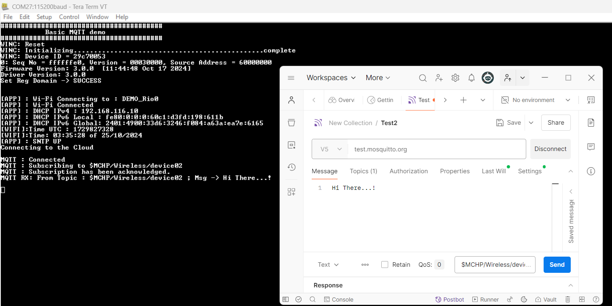

# Basic MQTT Demo Application

This WINCS02 application demonstrates unencrypted connection with Mosquitto MQTT server. The WINCS02 board acts as a MQTT client and connects to *test.mosquitto.org*. It requires only few Wi-Fi configuration changes, and the user can easily connect to Mosquitto server and send or receive messages.

# Building the Application

To build this application, open the project file \(`apps\basic_cloud_demo\firmware\basic_cloud_demo_sam_e54_xpro_wincs02.X/`\) in MPLAB X IDE. For more details on opening the project file in MPLAB X IDE, refer to the [Opening the Project File](https://onlinedocs.microchip.com/oxy/GUID-92FEB3A1-C10F-47DF-BF88-C06521800526-en-US-1/GUID-671CCA8C-64AE-4EA1-B144-D46A6FEE76FF.html#GUID-671CCA8C-64AE-4EA1-B144-D46A6FEE76FF__SECTION_YRV_2WM_QYB). The following table provides details on the project file.

|Project Name|Description|
|------------|-----------|
|`basic_cloud_demo_sam_e54_xpro_wincs02.X`|  -   MPLABX project for SAM E54 Xplained Pro evaluation kit and WINCS02 Add On Board
-   This application demonstrates on how user can configure the device with basic MQTT credientioals.

 

## Running the Application

1.  Mount the WI NCS02 Add On Board on SAM E54 Xplained Pro evaluation kit at respective header. For more details about the boards placement in the SAM E54 X-plained host board, see [Figure 6-70](https://onlinedocs.microchip.com/oxy/GUID-92FEB3A1-C10F-47DF-BF88-C06521800526-en-US-1/GUID-7BA99DE1-89EB-4DD7-973B-974B175D657A.html#GUID-7BA99DE1-89EB-4DD7-973B-974B175D657A__FIG_PKK_14T_11C)
2.  Connect the debugger USB port on the SAM E54 Xplained Pro evaluation kit to computer using a micro-USB cable.
3.  Open the project and launch MCC Harmony3.
4.  Configure the WINCS02 Wi-Fi ProvisionMode credentials, using the WINCS02 Wi-Fi configuration options. For more details about the Wi-Fi settings configuration, See [Figure 3-66](https://onlinedocs.microchip.com/oxy/GUID-92FEB3A1-C10F-47DF-BF88-C06521800526-en-US-1/GUID-CE9CEDFD-5FD4-4BC4-AB96-17647C430816.html#GUID-CE9CEDFD-5FD4-4BC4-AB96-17647C430816__FIG_NBX_GZS_SZB)
5.  Generate the code as illustrated below

     

    

     

6.  Build and program the code to the hardware using MPLABX IDE

     

    

     

7.  Open the Terminal application \(for example, Tera Term or PuTTY\) on the PC'
8.  Connect to the “EDBG Virtual COM Port�? and configure the serial settings as follows:
    1.  **Baud:** 115200
    2.  **Data:** 8 Bits
    3.  **Parity:** None
    4.  **Stop:** 1 Bit
    5.  **Flow Control:** None
9.  Press the SW0 \(Soft Reset\) button on the host board.
10. The board boots up. After successfully connecting with Wi-Fi, it connects to *test.mosquitto.org* on port 1883 \(unencrypted\).
11. To demonstrate successful MQTT connection, the board subscribes to topic *mchp/sample/b* and publishes a message on the same topic. The received message is printed in the terminal.

    