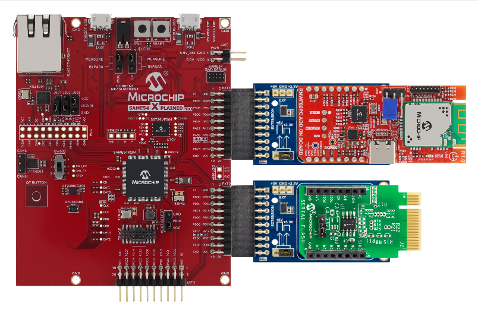
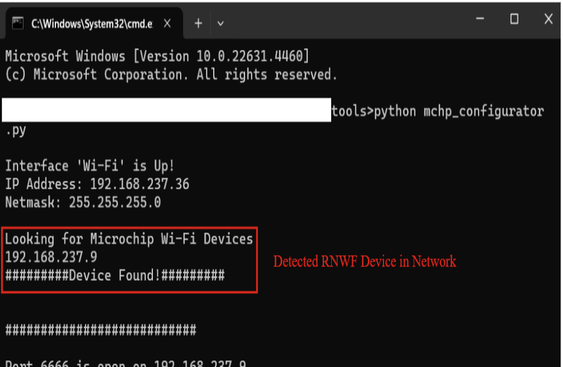
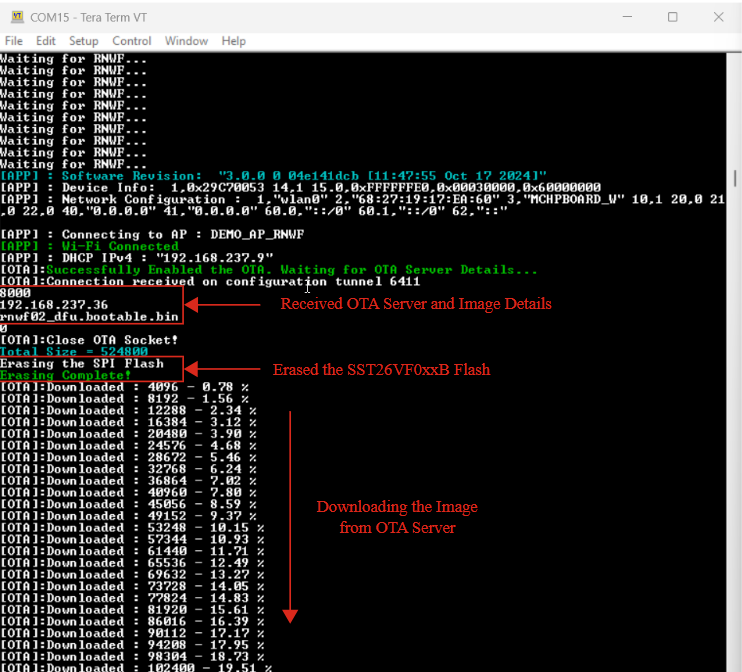
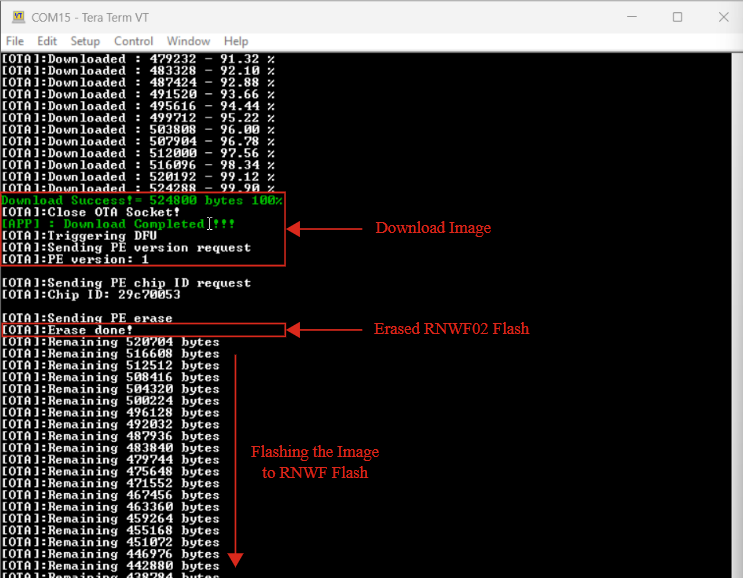

#  OTA Demo Application

The RNWF02 application facilitates an Over The Air (OTA) update for RNWF02. This application demonstrates the mechanism of upgrading the RNWF02 firmware via the HTTP/HTTPS protocol.

## Building the Application

To build this application, open the project file \(`apps/ota_demo/sam_e54_xpro_rnwf_uart.X`\) in MPLAB X IDE. For more details on opening the project file in MPLAB X IDE, refer to the [Opening the Project file](../wifi_easy_config/docs/GUID-671CCA8C-64AE-4EA1-B144-D46A6FEE76FF.md). The following table provides details on the project file.

|Project Name|Description|
|:-----------|:----------|
|`sam_e54_xpro_rnwf_uart.X`|  MPLAB X project for SAM E54 Xplained Pro evaluation kit and RNWF02 Add On Board
-   This OTA DFU application demonstrates the RNWF02 Firmware Upgrade mechanism through the HTTP/HTTPS protocol.

## Running the Application

 

1.  Mount the Serial Flash and RNWF02 Add On Board on the mikroBUS Xplained pro extension boards. Connect the RNWF02 connected mikroBUS Xplained pro extension board to the EXTENSION 1 HEADER and Serial Flash connected extension board to EXTENSION 2 HEADER of SAM E54 Xplained Pro evaluation kit as illustrated in the following figure.

     

    

     

2.  Connect the debugger USB port on the SAM E54 Xplained Pro evaluation kit to computer using a micro USB cable
3.  Open the project and launch MCC \(Microchip Code Configurator\).
4.  Configure Home-AP credentials for STA mode, using the Wi-Fi settings configuration. For more details about the Wi-Fi settings configuration, See [Figure  1](../wifi_easy_config/docs/GUID-CE9CEDFD-5FD4-4BC4-AB96-17647C430816.md#GUID-98F61951-56D2-4B91-B509-2A796802408B)

    **Note:** Configure chip-select \(CE\) for SPI Flash as illustrated in pin settings as shown below

     

    

     

5.  Generate the code as illustrated below.

    

6.  Build and program the code to the hardware using MPLAB X IDE

    

7.  Open the Terminal application \(for example, Tera Term or PuTTY\) on the PC
8.  Connect to the host board "EDBG Virtual COM Port" and configure the serial settings as follows:
    1.  **Baud:** 115200
    2.  **Data:** 8 Bits
    3.  **Parity:** None
    4.  **Stop:** 1 Bit
    5.  **Flow Control:** None
9.  Press the Reset button on the host board, see [Figure   1](#FIG_KR3_XXX_PZB)
10. The board boots up and connects to Home-AP, as per the configurations given in step 4. After the successful Wi-Fi connection the device opens up a TCP tunnel and wait for the OTA server and firmware image details from the configurator tool.

    

11. Two example sample firmware binaries are available in the `./ota_demo/tools` folder, start a python HTTP server using the following command.
    -   From File explorer, navigate to the folder \(`./ota_demo/tools`\)

        

    -   In the address bar, type **cmd** and hit enter

        

    -   This will open up a terminal window, located in this folder

        

    -   Start an HTTP server, enter `python -m http.server`. By default it will be listening on port 8000

        

12. Run the python OTA configurator tool from the `./ota_demo/tools` folder, as illustrated in the following figure
    -   From File explorer, navigate to the folder \(`./ota_demo/tools`\)

        

    -   In the address bar, type **cmd** and hit enter

        

    -   This will open up a terminal window, located in this folder

        

    -   Run the python OTA configurator by typing `python mchp_configurator.py`. Follow the instructions on the terminal, enter http server IP, port and filename image you want the RNWF to download.

        **Note:** Hit **Enter** when requested to enter IP and port and it will default to the computer IP and port 8000

        

13. Now the device creates a HTTP link with the OTA server and starts downloading the image file.

     

    

     

14. After successfully downloading the image, the DFU is triggered and firmware is Flashed into the RNWF02 module

     

    

     

15. Upon successful DFU, the host will Reset and print the RNWF02 module’s new firmware information

     

    

     
