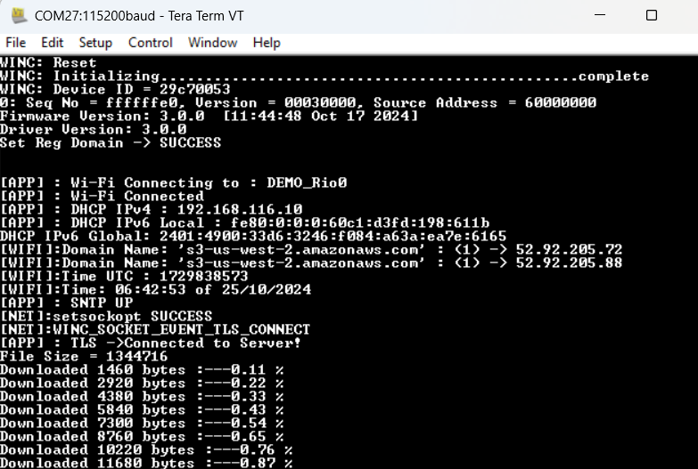

#  TLS Client Application

This WINCS02 application acts as a TLS Client. In this application, the device will securely connect with AWS S3 and tries to access/read the document. The WINCS02 will host a TLS Client in Wi-Fi STA mode. The user is required to configure the Wi-Fi credentials for Home-AP. The default application will connect to Home-AP and establish a connection with AWS S3.

## Building the Application

To build this application, open the project file \(`tls_client/firmware/tls_client_sam_e54_xpro_wincs02.X`\) in MPLAB X IDE. For more details on opening the project file in MPLAB X IDE, refer to the [Opening the Project file](../wifi_easy_config/docs/GUID-671CCA8C-64AE-4EA1-B144-D46A6FEE76FF.md). The following table provides details on the project file.

|Project Name|Description|
|:-----------|:----------|
|`tls_client_sam_e54_xpro_wincs02.X`|   MPLAB X project for SAM E54 Xplained Pro evaluation kit and WINCS02 Add On Board
-   In this application, the device will securely connect with AWS S3 and tries to access/read the document.

## Running the Application

 

1.  Mount the WINCS02 Add On Board on SAM E54 Xplained Pro evaluation kit at respective header. For more details about the boards placement in the SAM E54 X-plained host board, see [Figure 6-1](../wifi_easy_config/docs/GUID-7BA99DE1-89EB-4DD7-973B-974B175D657A.md#FIG_B4M_3WX_PZB)
2.  Connect the debugger USB port on the SAM E54 Xplained Pro evaluation kit to computer using a micro-USB cable.
3.  Open the project and launch MCC Harmony3.
4.  Configure Home-AP credentials for STA mode, using the WINCS02 Wi-Fi configuration options. For more details about the Wi-Fi settings configuration, See [Figure 1](../wifi_easy_config/docs/GUID-CE9CEDFD-5FD4-4BC4-AB96-17647C430816.md#GUID-98F61951-56D2-4B91-B509-2A796802408B)
5.  Generate the code as illustrated below

    

6.  Build and program the code to the hardware using MPLABX IDE

    

7.  Open the Terminal application \(for example, Tera Term or PuTTY\) on the PC
Connect to the "EDBG Virtual COM Port" and configure the serial settings as follows:

    1.  **Baud:** 115200
    2.  **Data:** 8 Bits
    3.  **Parity:** None
    4.  **Stop:** 1 Bit
    5.  **Flow Control:** None
8.  Press the Reset button on the host board, see [Figure   1](../wifi_easy_config/docs/GUID-7BA99DE1-89EB-4DD7-973B-974B175D657A.md#FIG_B4M_3WX_PZB).
9.  As the board boots up, it will connect to Home-AP and prints the IP address obtained. The board will establish a connection with AWS S3. After establishing a successful TLS server-client connection, the application will try to access/read the document listed.

    

10. Once the device receives entire document, `Receive Complete` message is printed on serial console as illustrated in the following figure.

    

