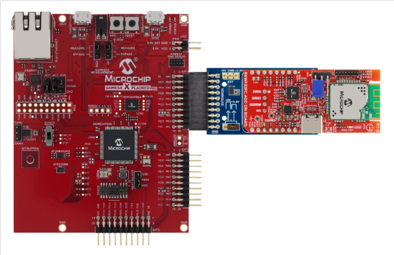

# 32-bit Example Applications

The host example applications provide few examples to demonstrate the RNWF features and  capabilities. These set of applications are based on SAM E54 XPLAINED board. These  examples use the following development tools:

 

1.  SAM E54 XPLAINED PRO EVALUATION KIT\([ATSAME54-XPRO](https://www.microchip.com/en-us/development-tool/atsame54-xpro)\)
2.  RNWF Add On Board \(EV72E72A\)
3.  Mikrobus Xplained Pro \([ATMBUSADAPTER-XPRO](https://www.microchip.com/en-us/development-tool/atmbusadapter-xpro)\)

 

 

 

-   **[TCP Client](../../tcp_client/readme.md)**  

-   **[TCP Server](../../tcp_server/readme.md)**  

-   **[Wi-Fi Easy Configuration](../readme.md)**  

-   **[Over the Air \(OTA\) Demo](../../ota_demo/readme.md)**  

-   **[Azure Cloud Demo](../../basic_cloud_demo/readme.md)**  

-   **[TLS Client](../../tls_client/readme.md)**  

