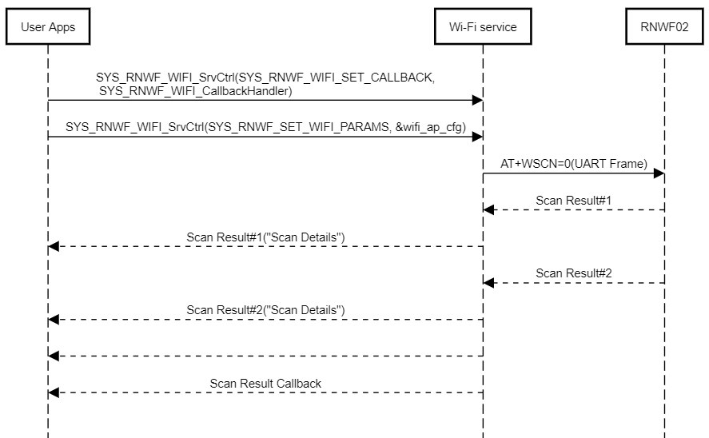

# Wi-Fi Service

The Wi-Fi service provides API’s to enable the following features:

1.  Station mode
2.  Soft AP mode

This section allows Wi-Fi service configuration as mentioned below:

-   **Wi-Fi Modes:** Drop-down to select Wi-Fi modes.

    Available options are:
    -   StationMode
    -   ProvisionMode
    -   SoftAPmode
-   **Provision Method:** Drop-down to select Wi-Fi Provisioning method.

    Available options are:
    -   Mobile App
    -   Web Server
-   **SSID:** Wi-Fi Access Point/Network Name
-   **Passphrase:** Wi-Fi Access point/Network password
-   **Security Type:** Wi-Fi security protocol
-   **Provision Callback Handler:** Configure callback function name for Wi-Fi Provisioning states \(Applicable only if selected Wi-Fi Mode is ProvisionMode\)
-   **WiFi-Callback Handler:** Configure callback function name to handle Wi-Fi service specific events \(for example, Wi-Fi STA connection and disconnection, DHCP resolution, Wi-Fi Scan indication\)

    **Wi-Fi System Service Configuration in MCC**

    <br />

    1.  <br />

        

        <br />

    2.  

    3.  

    <br />


The Wi-Fi Service API prototype is as follows:

``` {#CODEBLOCK_C2D_2JJ_MYB .language-c}
SYS_RNWF_RESULT_t SYS_RNWF_WIFI_SrvCtrl( SYS_RNWF_WIFI_SERVICE_t request, void *input)
```

It handles following services and reports the result to application over the return code or through the registered callback.

|Option/Command|Input|Description|
|:-------------|:----|:----------|
|`SYS_RNWF_SET_WIFI_PARAMS`| Mode, SSID, Passphrase, Security, Autoenable | Configures the provided Wi-Fi details and Triggers the connection<br /> based on auto enable flag|
|`SYS_RNWF_STA_CONNECT`|None|Triggers the Wi-Fi STA connection|
|`SYS_RNWF_STA_DISCONNECT`|None|Disconnects the connection|
|`SYS_RNWF_AP_DISABLE`|None|Disables the SoftAP mode|
|`SYS_RNWF_SET_WIFI_AP_CHANNEL`|Channel number|Configure the Wi-Fi channel|
|`SYS_RNWF_SET_WIFI_BSSID`|BSSID of AP \(String\)|Configure the Access point's BSSID to which RNWF needs to connect|
| `SYS_RNWF_SET_WIFI_TIMEOUT,`|Seconds \(int\)|Configure Wi-Fi connection timeout|
|`SYS_RNWF_SET_WIFI_HIDDEN,`|true or false|Configure Hidden mode SSID in SoftAP mode|
|`SYS_RNWF_WIFI_PASSIVE_SCAN`|None|Request/Trigger Wi-Fi passive scan|
|`SYS_RNWF_WIFI_ACTIVE_SCAN`|None|Request/Trigger Wi-Fi active scan|
|`SYS_RNWF_WIFI_SET_CALLBACK`|Callback Function handler|Register the call back for async events|

The following list captures the Wi-Fi callback event codes and their arguments

|Event|Response Components|Comments|
|:----|:------------------|:-------|
|`SYS_RNWF_CONNECTED`|Association ID: IntegerConnected State: Integer|Wi-Fi connected event code. Reports the connection's Association ID and connected state|
|`SYS_RNWF_DISCONNECTED`|Association ID: IntegerConnected State: Integer|Wi-Fi disconnected event code|
|`SYS_RNWF_CONNECT_FAILED`|Fail event code: Integer|Wi-Fi connection failure event code|
|`SYS_RNWF_DHCP_DONE`|DHCP IP: String|Wi-Fi DHCP complete event code|
|`SYS_RNWF_SCAN_INDICATION`|RSSI: Received signal strength Sec Type \(Int\): Recommended security type to use connecting to this AP \(10 options\)Channel \(Int\): Channel \# of device<br />BSSID \(String\): BSSID of detected device<br />SSID \(String\): SSID of detected device|Scan results to report each scan list|
|`SYS_RNWF_SCAN_DONE`|None|Scan complete event code|

The following figure illustrates the Station mode connection sequence

<br />


<br />

<br />


<br />

<br />

<br />



<br />

<br />

Following is the example of establishing connection in the Station mode

<br />

``` {#CODEBLOCK_JWD_FBL_JYB .language-c}
#include <stdio.h>
#include <rnwf_wifi_service.h>

/* Application Wifi Callback Handler function */
static void SYS_RNWF_WIFI_CallbackHandler ( SYS_RNWF_WIFI_EVENT_t event, uint8_t *p_str)
{      
    switch(event)
    {   
        /* Wi-Fi connected event code*/
        case SYS_RNWF_CONNECTED:
        {
            SYS_CONSOLE_PRINT("Wi-Fi Connected    \r\n");
            break;
        }
        
        /* Wi-Fi disconnected event code*/
        case SYS_RNWF_DISCONNECTED:
        {
            SYS_CONSOLE_PRINT("Wi-Fi Disconnected\nReconnecting... \r\n");
            SYS_RNWF_WIFI_SrvCtrl(SYS_RNWF_STA_CONNECT, NULL);
            break;
        }
        
        /* Wi-Fi DHCP complete event code*/
        case SYS_RNWF_DHCP_DONE:
        {
            SYS_CONSOLE_PRINT("DHCP IP:%s\r\n", &p_str[2]); 
            break;
        }
        
        default:
        {
            break;   
        }
    }    
}

/* Application Initialization function */
void APP_Initialize ( void )
{
    /* Place the App state machine in its initial state. */
    g_appData.state = APP_STATE_INITIALIZE;
}


/* Maintain the application's state machine. */
void APP_Tasks ( void )
{
    switch(g_appData.state)
    {
        /* Application's state machine's initial state. */
        case APP_STATE_INITIALIZE:
        {
            DMAC_ChannelCallbackRegister(DMAC_CHANNEL_0, APP_RNWF_usartDmaChannelHandler, 0);
            SYS_RNWF_IF_Init();
            
            g_appData.state = APP_STATE_REGISTER_CALLBACK;
            break;
        }
        
        /* Register the necessary callbacks */
        case APP_STATE_REGISTER_CALLBACK:
        {
            /* RNWF Application Callback register */
            SYS_RNWF_WIFI_SrvCtrl(SYS_RNWF_WIFI_SET_CALLBACK, SYS_RNWF_WIFI_CallbackHandler);
           
            /* Wi-Fii Connectivity */
            SYS_RNWF_WIFI_PARAM_t wifi_ap_cfg = {SYS_RNWF_WIFI_MODE_AP, SYS_RNWF_WIFI_PROV_SSID, SYS_RNWF_WIFI_PROV_PWD, SYS_RNWF_PROV_SECURITY,SYS_RNWF_WIFI_PROV_AUTOCONNECT};    
            SYS_RNWF_WIFI_SrvCtrl(SYS_RNWF_SET_WIFI_PARAMS, &wifi_ap_cfg);

             g_appData.state = APP_STATE_TASK;
            break;
        }
        
        /* Run Event handler */
        case APP_STATE_TASK:
        {
            SYS_RNWF_IF_EventHandler();
            break;
        }
        default:
        {
            break;
        }
    }
}
```

