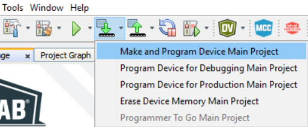
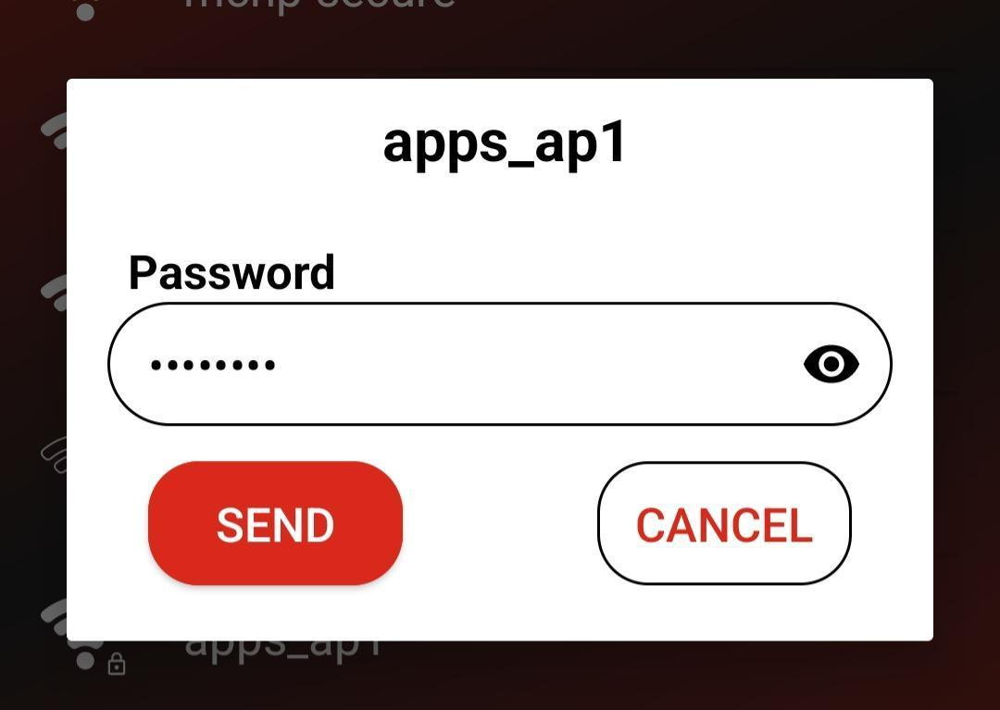

#  Wi-Fi Easy Configuration Application

This RNWF02 application uses the Wi-Fi ProvisionMode along with Microchip’s Wi-Fi Provisioning mobile application to explain how user can provision the device with Home-AP credentials. The device will boot-up in ProvisionMode, user will connect to ProvisionMode SSID via a third party STA (Mobile phone). User will then provide Home-AP credentials to the device using Microchip’s mobile app - Wi-Fi Provisioning. After the successful provisioning, device mode is set to Wi-Fi StationMode. It will then connect to Home-AP and gets an IP address.

## Building the Application

To build this application, open the project file (`apps/wifi_easy_config/firmware/sam_e54_xpro_rnwf_uart.X/`\) in MPLAB X IDE. For more details on opening the project file in MPLAB X IDE, refer to the [Opening the Project file](docs/GUID-671CCA8C-64AE-4EA1-B144-D46A6FEE76FF.md). The following table provides details on the project file.

|Project Name|Description|
|:-----------|:----------|
|`sam_e54_xpro_rnwf_uart.X`|  MPLABX project for SAM E54 Xplained Pro evaluation kit and RNWF02 Add On Board
-   This application demonstrates on how user can configure the device with Home-AP credentials
 

## Running the Application

1.  Mount the RNWF02 Add On Board on SAM E54 Xplained Pro evaluation kit at respective header. For more details about the boards placement in the SAM E54 X-plained host board, see [Figure 6-1](docs/GUID-7BA99DE1-89EB-4DD7-973B-974B175D657A.md#FIG_B4M_3WX_PZB)
2.  Connect the debugger USB port on the SAM E54 Xplained Pro evaluation kit to computer using a micro-USB cable.
3.  Open the project and launch MCC Harmony3.
4.  Configure the RNWF02 Wi-Fi ProvisionMode credentials, using the RNWF02 Wi-Fi configuration options. For more details about the Wi-Fi settings configuration, See [Figure 3](docs/GUID-CE9CEDFD-5FD4-4BC4-AB96-17647C430816.md#FIG_NBX_GZS_SZB)
5.  Generate the code as illustrated below.

    **Figure 6-31**. Generating the Code

    

6.  Build and program the code to the hardware using MPLABX IDE

    **Figure 6-32**. Programming the Board

    

7.  Open the Terminal application \(for example, Tera Term or PuTTY\) on the PC'
8.  Connect to the “EDBG Virtual COM Port" and configure the serial settings as follows:
    1.  **Baud:** 115200
    2.  **Data:** 8 Bits
    3.  **Parity:** None
    4.  **Stop:** 1 Bit
    5.  **Flow Control:** None
9.  The board boots up in Wi-Fi ProvisionMode, as per the configurations given in step 4. ProvisionMode SSID, IP address and Server port number will be available on the serial console as illustrated in the following figure. Connect to the ProvisionMode SSID via third party STA \(any Mobile Phone\).

    **Figure 6-33**. ProvisionMode Serial Logs.

    

10. After establishing a successful connection between mobile phone and the ProvisionMode SSID, open Wi-Fi Provisioning application in mobile phone and enter Server IP address and port number as illustrated below and press Connect.

    Figure 6-14. Connecting to Provisioning Page

      

11. On the next page, select AP and provide the Password and Press Send

    

12. After successful provisioning, the board will connect to the Home-AP and gets an IP address. This IP address is displayed on the serial console as illustrated below.Figure 6-16. STA Mode Serial Logs

    

