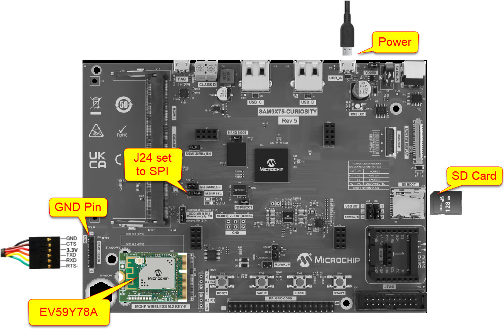
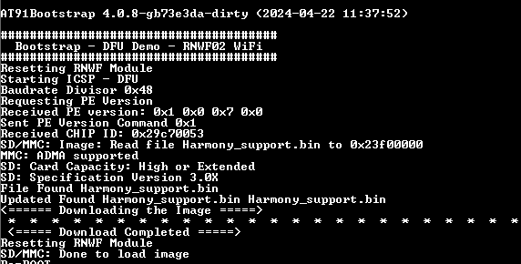
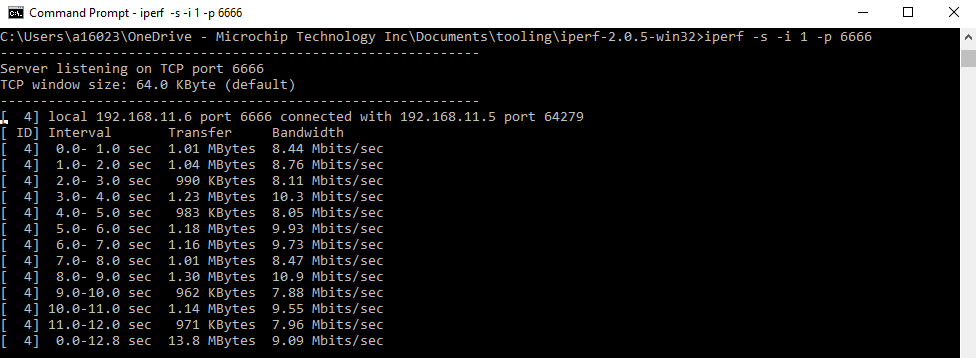
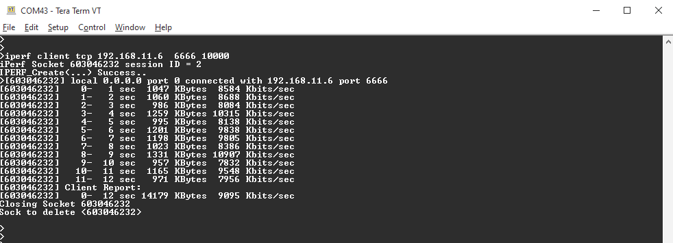
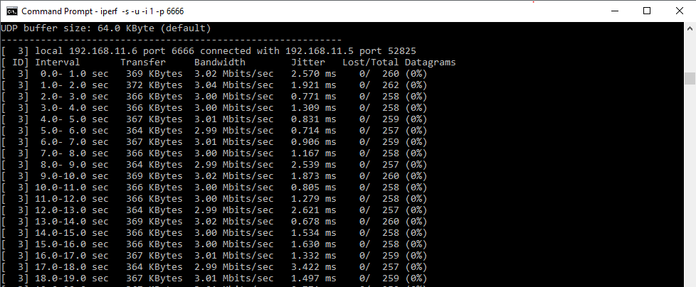
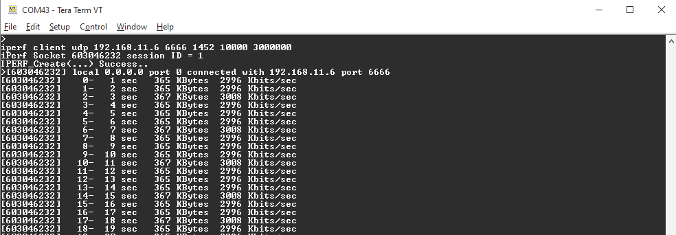

# iPerf Application 

This application run iPerf tool for the measurements of the maximum achievable bandwidth on IP networks. User can execute iPerf command on the host MCU console to configure as TCP/UDP server or client and transfer packets with the peer device in the same network and measure the throughput. This example application shows running iperf and measuring the network performance

## Downloading and building the application

To clone or download this application from Github, go to the [main page of this repository](https://github.com/Microchip-MPLAB-Harmony/wireless_apps_rnwf) and then click Clone button to clone this.

Path of the application within the repository is **apps/wifi_iperf/firmware** .

To build the application, refer to the following table and open the project using its IDE.

| Project Name      | Description                                    |
| ----------------- | ---------------------------------------------- |
| iperf_sam_9x75_curiosity_wincs02.X | MPLABX project for [SAM9X75 CURIOSITY DEVELOPMENT BOARD](https://www.microchip.com/en-us/development-tool/EV31H43A) |
|||

## Setting up AT91Bootstrap loader

To load the application binary onto the target device, we need to use at91bootstrap loader. Refer to the [at91bootstrap loader documentation](https://onlinedocs.microchip.com/oxy/GUID-270C6E29-0B84-4557-9BB9-8CF21183FAD7-en-US-2/GUID-0FA935BA-EE65-4BB4-B09E-A70E91D1EC02.html) for details on how to configure, build and run bootstrap loader project and use it to bootstrap the application binaries.

## Setting up the hardware

The following table shows the target hardware for the application projects.

| Project Name| Board|
|:---------|:---------:|
| iperf_sam_9x75_curiosity_wincs02.X | [SAM9X75 CURIOSITY DEVELOPMENT BOARD](https://www.microchip.com/en-us/development-tool/EV31H43A) |
|||

### Setting up [SAM9X75 CURIOSITY DEVELOPMENT BOARD](https://www.microchip.com/en-us/development-tool/EV31H43A) and perform Device Firmware Upgrade (DFU)

When you use the WIxCS02 M.2 Wi-Fi Module the 1st time, you need to perform DFU to upgrade the appropriate firmware in the M.2 Wi-Fi Module.  
If the M.2 Wi-Fi module was performed the DFU, skip step 1 and step 5.

1. Program the WIxCS02 M.2 Wi-Fi Module with the correct firmware image

    1.1 Download the Harmony_support.bin and boot.bin from the repository, GitHub [EA03X56A-wifi/m2](https://github.com/MicrochipTech/GSG/tree/main/EA03X56A/wifi/m2/)

    **Notes:**
    The file named "boot.bin" is used both in the programming of the M.2 module and during the application runtime.The "boot.bin" for programming the M.2 module's Firmware can be found at GitHub [EA03X56A-wifi/m2](https://github.com/MicrochipTech/GSG/tree/main/EA03X56A/wifi/m2/) while the "boot.bin" for application runtime can be found under deps folder at the root of the repository. 
    These "boot.bin" files are two distinct files that share the same name. Ensure that the copied files is taken from the specific Github link for that step.

    1.2 Copy the downloaded Harmony_support.bin and boot.bin to the SD card.  

2. Connect the components as shown in the accompanying image:

    2.1 Connect WIxCS02 M.2 Wi-Fi Module to J20 M.2 connector.

    2.2 SD card inserted on the SD Boot J14 slot.

    2.3 Serial-USB dongle to UART DEBUG J35 header.

    2.4 Set J24:M.2  I/F SEL to SPI,
    2.5 USB-A to Micro ​​​​​USB-B cable to J2 Micro ​​​​USB-B port for power.

    

    

3. Open the Terminal application \(Ex.:Tera term\) on the computer  
   Connect to the "USB-FTDI" COM port and configure the serial settings as follows:

    -   Baud : 115200

    -   Data : 8 Bits

    -   Parity : None

    -   Stop : 1 Bit

    -   Flow Control : None

4. Power on the board
5. Confirm using the console that the image copied in Step 1.2 is used in the Device Firmware Update. 
    

    

6. When you run the applicatin in the next section, unplug the SD card if you use the JTAG debugger. Or replace the boot.bin (which found under deps folder at the root of the repository) in the SD card if SD card is used to boot the applicaiton. Refer to to above section *Setting up AT91Bootstrap loader* for more details.

## Running the Application

1. Open the project and launch Harmony3 configurator.

2. Configure Home-AP credentials for STA mode, using the WINCS02 Wi-Fi configuration options. For more details about the Wi-Fi settings configuration, See [Figure 3-64](https://onlinedocs.microchip.com/oxy/GUID-92FEB3A1-C10F-47DF-BF88-C06521800526-en-US-1/GUID-CE9CEDFD-5FD4-4BC4-AB96-17647C430816.html#GUID-CE9CEDFD-5FD4-4BC4-AB96-17647C430816__GUID-98F61951-56D2-4B91-B509-2A796802408B)
3. Save configurations and generate code via MHC
4. Build and program the generated code into the hardware using its IDE
5. Open the Terminal application \(Ex.:Tera term\) on the computer  
   Connect to the "USB-FTDI" COM port and configure the serial settings as follows:

    -   Baud : 115200

    -   Data : 8 Bits

    -   Parity : None

    -   Stop : 1 Bit

    -   Flow Control : None

7. When the board is booting up, it connect to the targ Wi-Fi AP and the terminal (SAM9x75 console) show below log:
    

    

8. Connect PC to the same network (same Wi-Fi AP), download [iperf tool](https://sourceforge.net/projects/iperf2/files/) for the PC. 
9. Run iPerf tool on both the SAM9x75 Curisoity Development Board and PC to measure the network performance.  
   The following table show the command used on the SAM9x75 Curiosity Board and PC  

    
    | Test      | Description                                    | Command on SAM9x75| Command on PC |
    | ----------------- | ---------------------------------------------- |------------------|--------------|
    | TCP Uplink | Transfer packets from SAM9x75 to PC| iperf client tcp <IP_ADDRESS> <PORT_NUM> <NUM_OF_PACKET> | iperf -s -i 1| 
    | TCP Downlink | Transfer packets from PC to SAM9x75| iperf server tcp <PORT_NUM> | iperf -c <IP_ADDRESS> -i 1| 
    | UDP Uplink | Transfer Packet from SAM9x75 to PC| iperf client udp <IP_ADDRESS> <PORT_NUM> <PACKET_LEN> <NUM_OF_PACKET> <BPS_RATE> | iperf -s -u -i 1| 
    | UDP Downlink | Transfer packets from PC to SAM9x75| iperf server udp <PORT_NUM> | iperf -u -c <IP_ADDRESS> -i 1| 
    |||

10. For example, to perform TCP Uplink test, run command "iperf -s -i 1 -p 6666" on PC command prompt
    

    

11. On terminal (SAM9x75 console), run command "iperf client tcp <IP_ADDRESS> 6666 10000"
    The following picture show the result
    

    

12. Another example, to perform UDP Uplink test, run command "iperf -s -u -i 1 -p 6666" on PC command prompt
    

    

13. On terminal (SAM9x75 console), run command "iperf client udp <IP_ADDRESS> 6666 1452 10000 10000000"
The following picture show the result
    

    
